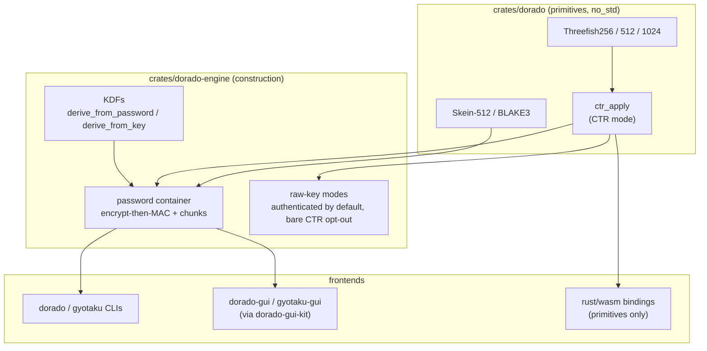
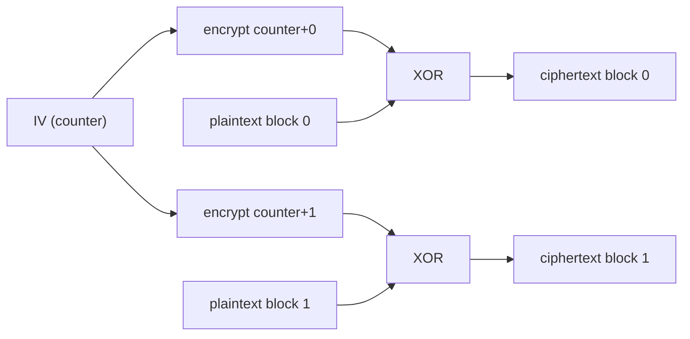
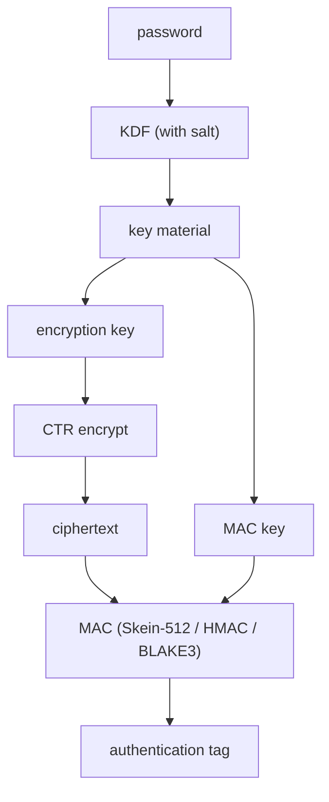
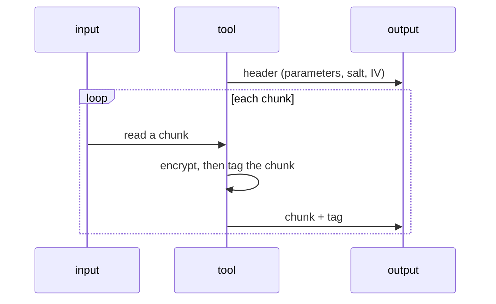
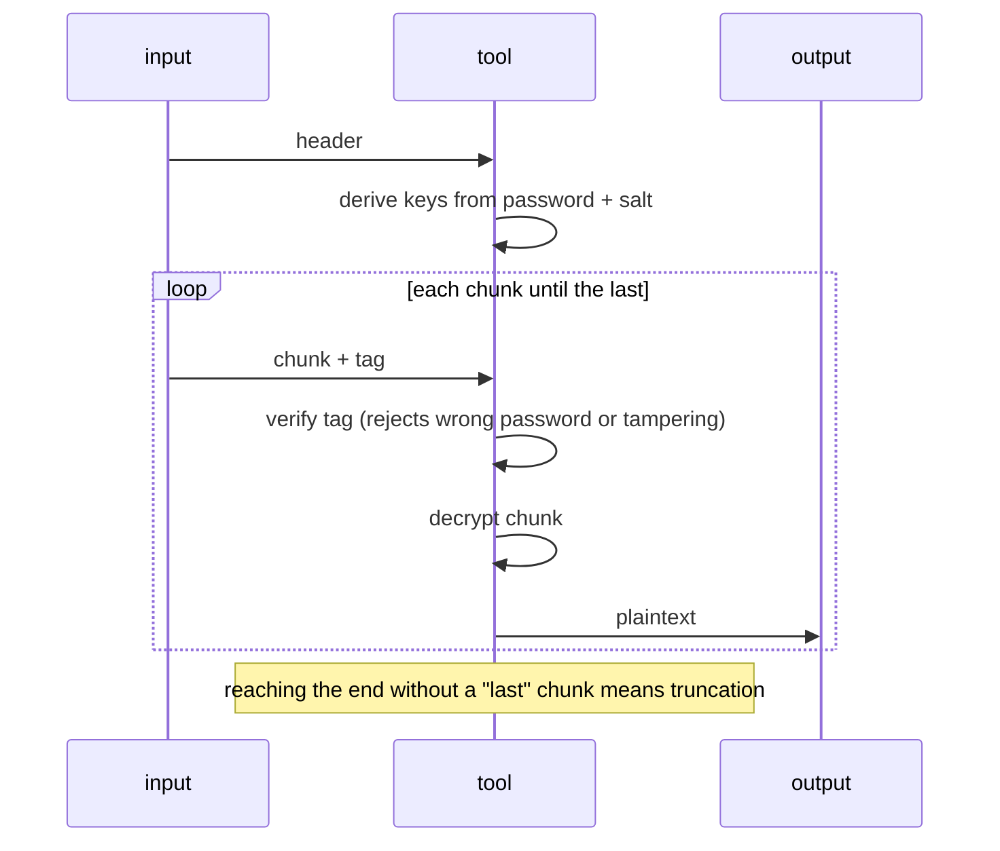

# Dorado overview

This is the conceptual tour of dorado: what it is, how the pieces fit, and what it
does and does not protect. It is written for a general technologist, not a
cryptographer, and it avoids byte-level detail. For the precise wire format and
constants, see [`../../docs/spec.md`](../../docs/spec.md). For definitions of terms
(block cipher, CTR, KDF, MAC, and so on), see
[`../../docs/glossary.md`](../../docs/glossary.md). Those two are project-wide (all
the ports share the format); this tour is the Rust-flavored one.

Dorado is an educational, unaudited project. Nothing here is a security claim.

## The layered mental model

The most useful idea is that dorado is built in layers, each a thin step above the
last. The cipher is the foundation; everything else is standard machinery wrapped
around it. Two library crates hold all the cryptography:

- `crates/dorado` is the primitives library: Threefish in all three sizes, CTR,
  and the from-scratch hashes (Skein-512 and BLAKE3). It is `no_std`; its one
  optional runtime dependency is `zeroize` (on by default), which wipes each
  cipher's key schedule on drop.
- `crates/dorado-engine` is the construction: the password KDFs and both public
  derivation entry points (`derive_from_password`, the slow stretch, and
  `derive_from_key`, the fast fan-out of an already-strong key), the MAC menu,
  the authenticated chunked password container, and the two raw-key modes.

The frontends are thin consumers of those two crates: the `dorado` and `gyotaku`
CLIs, the `dorado-gui` and `gyotaku-gui` desktop apps (sharing widgets via
`dorado-gui-kit`), and the `rust/wasm` bindings, which compile the verified
primitives (not the engine) to WebAssembly for the TypeScript port and the
browser demo.

The line that matters runs between the library crates and the frontends. The
libraries are the part that matters cryptographically and are checked against
official test vectors; the frontends are plumbing (arguments, files, windows)
that calls the same library code everywhere.

## Layer 1: the cipher

Threefish is the actual algorithm. It is a tweakable block cipher: a keyed,
reversible scramble of one fixed-size block of data, with an extra non-secret
"tweak" input that varies the result. It comes in three sizes, working on 32-, 64-,
or 128-byte blocks. This is the part dorado implements from scratch.

By itself a block cipher can only transform exactly one block. That is the whole
reason the other layers exist.

## Layer 2: CTR mode

CTR (counter mode) is a generic recipe for turning any block cipher into something
that handles data of any length. It encrypts a counter (0, 1, 2, and so on) to
produce a pseudorandom keystream, then combines that keystream with the data using
XOR.

CTR is the same operation forwards and backwards, so one routine both encrypts and
decrypts. It only ever calls the cipher; it contains no cipher internals, which is
why it is a mode and not part of Threefish. Two things matter: never start the
counter at the same value twice under one key, and CTR gives confidentiality only.
It does not detect tampering. Closing that gap is the job of the next layer.

## Layer 3: the engine and its frontends

The engine has two ways to take the key, and both stream data in constant memory
so they handle files larger than RAM. The CLI exposes both; the GUI exposes the
password path.

- **Raw key**: you provide the exact key bytes and the starting counter yourself.
  By default the output is still authenticated: the engine splits your key into
  independent encryption and MAC subkeys (domain-separated keyed Skein-512, with
  no password stretching, since the key is already strong), then frames and tags
  the data with the same encrypt-then-MAC chunk machinery as the password
  container, binding the tweak and IV into the first frame's authenticated data.
  An explicit `--unauthenticated` flag opts out to bare CTR: no framing, no
  integrity, the primitive exposed honestly.
- **Password**: you provide a password and the tool does the rest. This path adds
  key derivation, authentication, and a self-describing file format.

The interesting machinery is mostly in the password path.

### Passwords are not keys

A password is something a human can remember; a key is full-entropy bytes of an
exact size. They are not interchangeable. A key derivation function (KDF) bridges
the two: it stretches the password, together with a random salt, into a real key.
A good password KDF is deliberately slow and memory-hungry so that guessing many
candidate passwords is expensive. Dorado offers three (Argon2id, scrypt, PBKDF2);
the salt and cost settings are stored in the file so decryption can repeat the
derivation.

### Authentication: encrypt-then-MAC

Because CTR alone cannot detect tampering, the password path adds a message
authentication code (MAC), using the safe encrypt-then-MAC order: encrypt the data,
then compute a tag over the ciphertext, and on the way back, check the tag before
decrypting anything. Two independent keys are derived, one for encryption and one
for the MAC, so no single key does two jobs.

You choose the MAC from three options, all built from scratch: Skein-512 (the
default, the keyed form of the hash Threefish was designed for), HMAC-SHA256, or
keyed BLAKE3. They are interchangeable here because all three are the same kind of
tool, a keyed hash that behaves like a pseudorandom function, so any of them slots
into the encrypt-then-MAC step and produces a 32-byte tag. The choice is recorded
in the file header and is itself authenticated, so it cannot be tampered with.

A neat consequence: a wrong password produces a wrong MAC key, so it fails the same
check as a tampered file. Both are reported as a clear error rather than silently
decrypting to garbage.

### Streaming in chunks

A single tag over the whole file cannot be streamed safely: you would have to read
the entire file to verify it before you could trust any of the output. So the
password path splits the data into fixed-size chunks and authenticates each one on
its own. Decryption can then verify and release one chunk at a time, in constant
memory.

Decryption mirrors this, verifying each chunk's tag before decrypting it, and
treating an unexpected end of input as truncation:

## Threat model: what is and is not defended

For the password path (and for the default authenticated raw-key mode, which
reuses the same frame machinery):

- A **tampered file** is detected: changing any ciphertext byte or any header
  parameter (the variant, KDF settings, salt, tweak, or IV) makes a tag fail.
- A **wrong password** is detected and reported, not silently mishandled.
- **Reordered, duplicated, or dropped chunks** are detected, because each chunk's
  tag covers its position.
- A **truncated file** is detected, because the final chunk is marked and that mark
  is authenticated, so a missing end is noticed.

What it does not defend against, stated plainly:

- **Raw-key mode with `--unauthenticated` has no integrity at all.** It is bare
  CTR by design: a flipped ciphertext bit silently flips the matching plaintext
  bit, with no error. The default raw-key mode is authenticated like the password
  container; the opt-out exists for interop and for seeing the bare primitive,
  and callers who take it own that gap.
- **Whole-file substitution, partly.** The MAC authenticates a file's contents,
  not its name or where it sits, so an attacker could swap one valid file for
  another. The v4 format's label narrows this: `--label` binds an authenticated
  context string into the file, and decrypting with `--expect-label` (the
  `decrypt_password_stream_expecting` API) rejects a substituted but otherwise
  valid file whose label does not match. This is a mitigation, not a full fix:
  it only helps when the caller sets and checks labels, and two files carrying
  the same label remain interchangeable.
- **Partial output on failure.** Because decryption streams, verified early chunks
  may already be written when a later chunk fails. A non-zero exit means the output
  is incomplete and must not be trusted, even if some bytes appeared.
- **It is not audited and not a guaranteed-constant-time implementation.** The ARX
  cipher uses only data-independent operations, so a straightforward build tends to
  run in constant time, but that is a property of the design, not a promise.

For real data, prefer an audited tool.

## Secrets in memory while the tool runs

The section above is about the file. A separate question is a secret's exposure
inside the running process, before it is wiped. The adversary here is different:
another process running as the same user (the class infostealer malware
exploits), a core-dump file left after a crash, or a swap file. Handled,
strongest first:

- **The password.** One locked, wiped buffer. The CLI's `LockedPassword` and the
  GUI's `SecretHandle` (rime's `secure_input`) both `mlock` it out of swap
  best-effort and zeroize it on drop, and the buffer never reallocates, so no
  `realloc` leaves a stale copy behind. The GUI field additionally never renders
  the characters (it draws mask bullets as plain geometry) and emits only unit
  messages, so the password never enters iced's message queue, widget tree, or
  text shaper. This is the strong tier.
- **The message plaintext and the decrypted output (GUI).** Held in `Zeroizing`
  buffers, wiped when replaced and on exit, including the worker thread's copies
  and the whole-file buffers. But these are visible text, weaker than the
  password in two ways the app cannot close: they are not `mlock`'d, so they can
  reach swap, and displaying readable characters forces iced/cosmic-text to keep
  their own copies in text and glyph buffers no widget can reach or wipe. The app
  wipes every copy it owns; it cannot wipe the toolkit's.
- **Process hardening (GUI).** To cover exactly that residual, the GUI disables
  core dumps at startup (`RLIMIT_CORE` = 0) and, on Linux, marks itself
  non-dumpable (`PR_SET_DUMPABLE` = 0), which also refuses `ptrace` from same-user
  processes. The un-wipeable toolkit copies then stop being reachable by anything
  short of code already executing as the user, which no in-process wiping would
  stop either. Done through the safe `rustix` wrapper, so no `unsafe` enters
  dorado; skipped under `DORADO_NO_HARDEN` and the screenshot harness.
- **The clipboard.** Copying output hands it to the OS, which keeps its own copy.
  A configurable clear-after-N-seconds timer (default 30s) bounds how long the
  system clipboard holds it but cannot recall a copy already read, and clipboard
  managers keep their own history. The password field has no copy-out at all.

Out of scope, the limits every userspace tool shares: root, a compromised kernel,
cold-boot or DMA attacks, a debugger attached before startup, and a keylogger or
IME upstream of the app. macOS gets core-dump suppression only; its anti-debug
primitive is a private, unreliable API and is deliberately not used. Hardening
raises the bar against unprivileged same-user snooping; it is not a wall.

## How we know it works

Confidence comes from several independent checks:

- **Known-answer tests**: official published vectors for each block size, checking
  the cipher matches the specification exactly.
- **Differential tests**: dorado compared against an independent implementation
  (the RustCrypto `threefish` crate) over thousands of random inputs. The other
  from-scratch primitives are checked the same way: Skein-512 and BLAKE3 against the
  RustCrypto `skein` and `blake3` crates.
- **CTR tests**: anchored to the verified cipher, plus round-trips at awkward
  lengths.
- **Unit tests** for the file header, the KDFs, each of the three MACs, and the
  chunk counter.
- **End-to-end checks** of the CLI for round-trips, tampering, and truncation.
- **Fuzzing**: a cargo-fuzz (libFuzzer) harness in `rust/fuzz` feeds the decrypt
  path malformed inputs to hunt for crashes and panics; run it with
  `cargo +nightly fuzz run decrypt`. This is a testing tool, not shipped code.

To see the cross-implementation agreement directly, run `cargo run --example
compare`: it encrypts one block with dorado, with the RustCrypto `threefish` crate,
and prints the official Crypto++ vector, showing all three produce identical
ciphertext for the same key, tweak, and plaintext.

## Roadmap

The lineage is now complete: Skein, the hash function Threefish was designed for, is
built on top of the cipher via its chaining mode (UBI). It appears two ways, as the
default authentication MAC and as a standalone `gyotaku` hashing tool (the Skein
counterpart of `sha256sum`). The other early candidates have landed as well: the
primitives crate is `no_std` (allocation-free with `--no-default-features`), and
the optional `cipher` and `digest` features implement the RustCrypto traits for
ecosystem interop.
