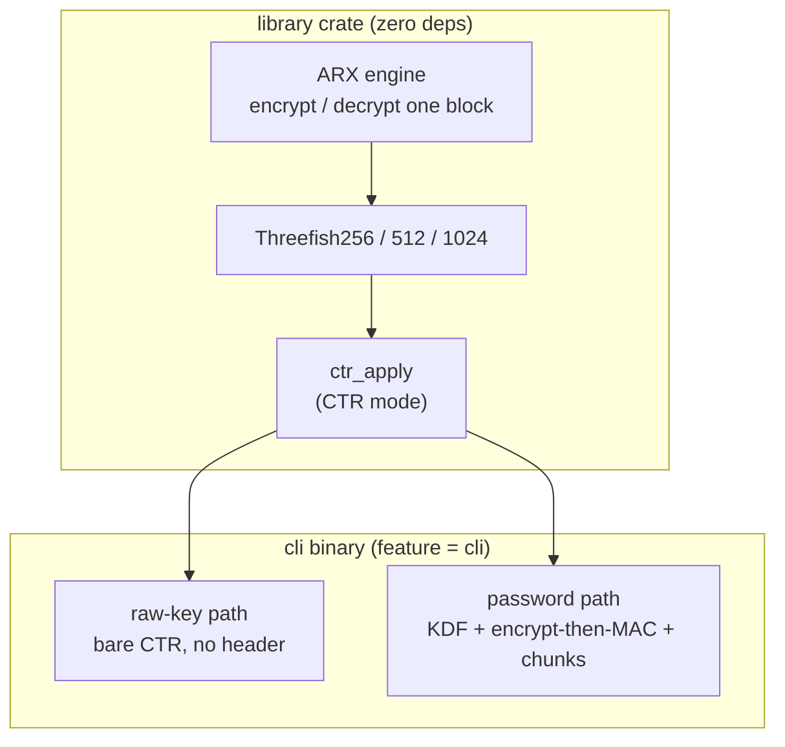
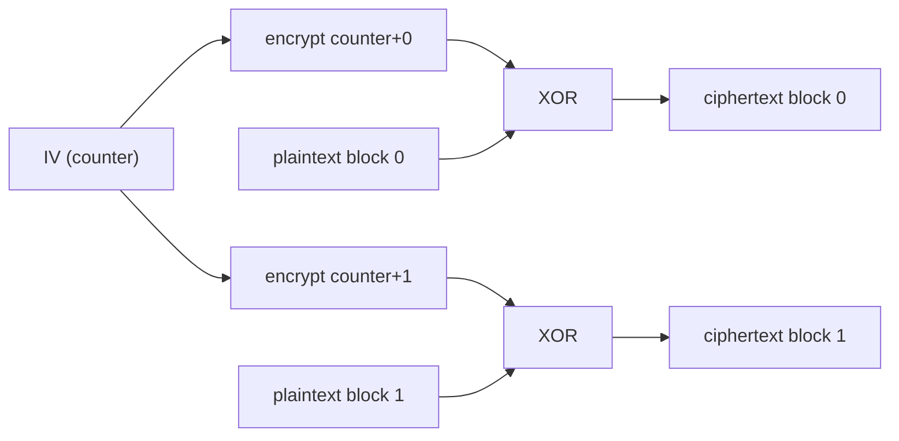
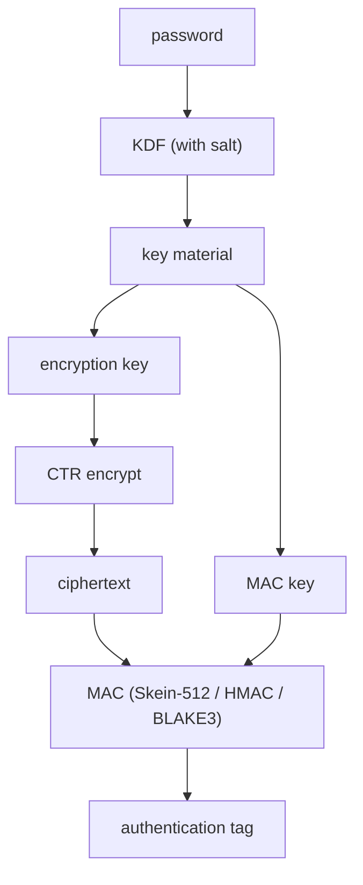
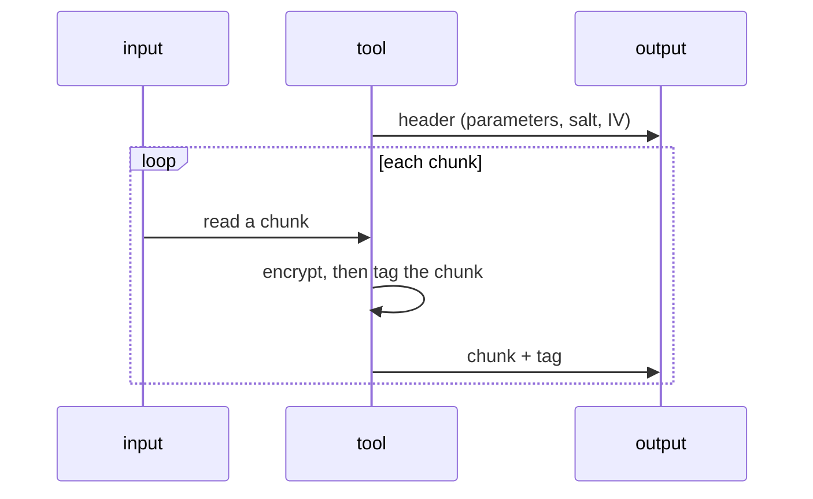
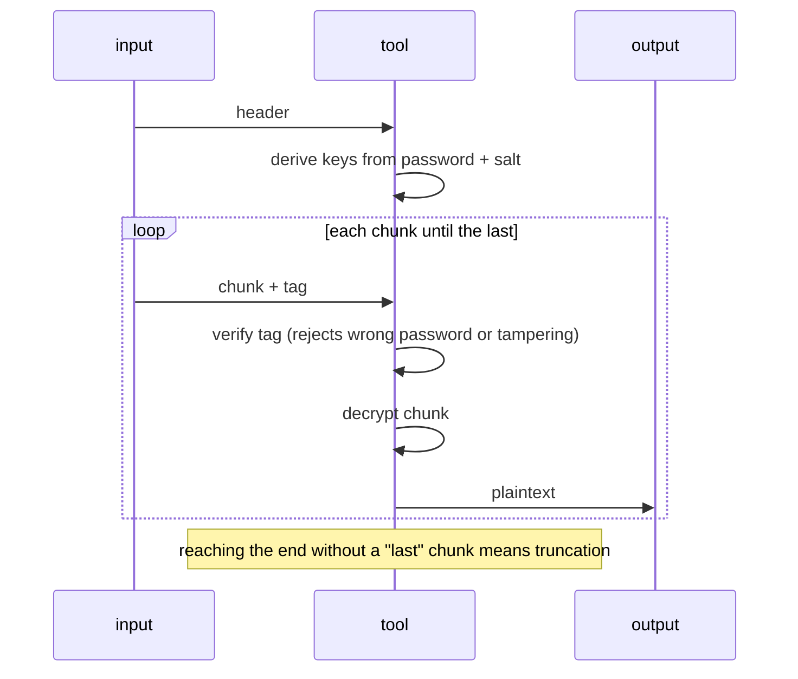

# Dorado overview

This is the conceptual tour of dorado: what it is, how the pieces fit, and what it
does and does not protect. It is written for a general technologist, not a
cryptographer, and it avoids byte-level detail. For the precise wire format and
constants, see [`../../docs/spec.md`](../../docs/spec.md). For definitions of terms
(block cipher, CTR, KDF, MAC, and so on), see
[`../../docs/glossary.md`](../../docs/glossary.md). Those two are project-wide (all
the ports share the format); this tour is the Rust-flavored one.

Dorado is an educational, unaudited project. Nothing here is a security claim.

## The layered mental model

The most useful idea is that dorado is built in layers, each a thin step above the
last. The cipher is the foundation; everything else is standard machinery wrapped
around it. The library crate is just the cipher and one convenience mode, with zero
runtime dependencies. Everything to do with passwords, key derivation,
authentication, and file framing lives in the command-line tool, behind the
optional `cli` feature.

The `cli`/`lib` line is the trust boundary. The library is the part that matters
cryptographically and is checked against official test vectors. The CLI is plumbing
that composes well-known building blocks.

## Layer 1: the cipher

Threefish is the actual algorithm. It is a tweakable block cipher: a keyed,
reversible scramble of one fixed-size block of data, with an extra non-secret
"tweak" input that varies the result. It comes in three sizes, working on 32-, 64-,
or 128-byte blocks. This is the part dorado implements from scratch.

By itself a block cipher can only transform exactly one block. That is the whole
reason the other layers exist.

## Layer 2: CTR mode

CTR (counter mode) is a generic recipe for turning any block cipher into something
that handles data of any length. It encrypts a counter (0, 1, 2, and so on) to
produce a pseudorandom keystream, then combines that keystream with the data using
XOR.

CTR is the same operation forwards and backwards, so one routine both encrypts and
decrypts. It only ever calls the cipher; it contains no cipher internals, which is
why it is a mode and not part of Threefish. Two things matter: never start the
counter at the same value twice under one key, and CTR gives confidentiality only.
It does not detect tampering. Closing that gap is the job of the next layer.

## Layer 3: the command-line tool

The CLI has two ways to supply the key, and both stream data in constant memory so
they handle files larger than RAM.

- **Raw key**: you provide the exact key bytes and the starting counter yourself.
  The output is bare CTR ciphertext with no container and no authentication. This
  is the primitive, exposed honestly.
- **Password**: you provide a password and the tool does the rest. This path adds
  key derivation, authentication, and a self-describing file format.

The interesting machinery is all in the password path.

### Passwords are not keys

A password is something a human can remember; a key is full-entropy bytes of an
exact size. They are not interchangeable. A key derivation function (KDF) bridges
the two: it stretches the password, together with a random salt, into a real key.
A good password KDF is deliberately slow and memory-hungry so that guessing many
candidate passwords is expensive. Dorado offers three (Argon2id, scrypt, PBKDF2);
the salt and cost settings are stored in the file so decryption can repeat the
derivation.

### Authentication: encrypt-then-MAC

Because CTR alone cannot detect tampering, the password path adds a message
authentication code (MAC), using the safe encrypt-then-MAC order: encrypt the data,
then compute a tag over the ciphertext, and on the way back, check the tag before
decrypting anything. Two independent keys are derived, one for encryption and one
for the MAC, so no single key does two jobs.

You choose the MAC from three options, all built from scratch: Skein-512 (the
default, the keyed form of the hash Threefish was designed for), HMAC-SHA256, or
keyed BLAKE3. They are interchangeable here because all three are the same kind of
tool, a keyed hash that behaves like a pseudorandom function, so any of them slots
into the encrypt-then-MAC step and produces a 32-byte tag. The choice is recorded
in the file header and is itself authenticated, so it cannot be tampered with.

A neat consequence: a wrong password produces a wrong MAC key, so it fails the same
check as a tampered file. Both are reported as a clear error rather than silently
decrypting to garbage.

### Streaming in chunks

A single tag over the whole file cannot be streamed safely: you would have to read
the entire file to verify it before you could trust any of the output. So the
password path splits the data into fixed-size chunks and authenticates each one on
its own. Decryption can then verify and release one chunk at a time, in constant
memory.

Decryption mirrors this, verifying each chunk's tag before decrypting it, and
treating an unexpected end of input as truncation:

## Threat model: what is and is not defended

For the password path:

- A **tampered file** is detected: changing any ciphertext byte or any header
  parameter (the variant, KDF settings, salt, tweak, or IV) makes a tag fail.
- A **wrong password** is detected and reported, not silently mishandled.
- **Reordered, duplicated, or dropped chunks** are detected, because each chunk's
  tag covers its position.
- A **truncated file** is detected, because the final chunk is marked and that mark
  is authenticated, so a missing end is noticed.

What it does not defend against, stated plainly:

- **Raw-key mode has no authentication at all.** It is bare CTR by design.
- **Whole-file substitution.** The MAC authenticates a file's contents, not its
  name or where it sits, so an attacker could swap one valid file for another.
- **Partial output on failure.** Because decryption streams, verified early chunks
  may already be written when a later chunk fails. A non-zero exit means the output
  is incomplete and must not be trusted, even if some bytes appeared.
- **It is not audited and not a guaranteed-constant-time implementation.** The ARX
  cipher uses only data-independent operations, so a straightforward build tends to
  run in constant time, but that is a property of the design, not a promise.

For real data, prefer an audited tool.

## How we know it works

Confidence comes from several independent checks:

- **Known-answer tests**: official published vectors for each block size, checking
  the cipher matches the specification exactly.
- **Differential tests**: dorado compared against an independent implementation
  (the RustCrypto `threefish` crate) over thousands of random inputs. The other
  from-scratch primitives are checked the same way: Skein-512 and BLAKE3 against the
  RustCrypto `skein` and `blake3` crates.
- **CTR tests**: anchored to the verified cipher, plus round-trips at awkward
  lengths.
- **Unit tests** for the file header, the KDFs, each of the three MACs, and the
  chunk counter.
- **End-to-end checks** of the CLI for round-trips, tampering, and truncation.
- **Fuzzing (proposed)**: feeding the header and frame parser many malformed inputs
  to hunt for crashes. This is a testing tool, not shipped code.

To see the cross-implementation agreement directly, run `cargo run --example
compare`: it encrypts one block with dorado, with the RustCrypto `threefish` crate,
and prints the official Crypto++ vector, showing all three produce identical
ciphertext for the same key, tweak, and plaintext.

## Roadmap

The lineage is now complete: Skein, the hash function Threefish was designed for, is
built on top of the cipher via its chaining mode (UBI). It appears two ways, as the
default authentication MAC and as a standalone `gyotaku` hashing tool (the Skein
counterpart of `sha256sum`). Remaining candidates: making the core run without the
standard library, and implementing the RustCrypto `cipher` traits for ecosystem
interop.
